# Refactoring

## Theatre

Martin Fowler's Refactoring Second Edition adds a whole new example.

It says:

> A company of theatrical players who go out to various events performing
> plays. Typically, a customer will request a few plays and the company charges
> them based on the size of the audience and the kind of play they perform. There
> are currently two kinds of plays that the company performs: tragedies and
> comedies. As well as providing a bill for the performance, the company gives its
> customers “volume credits” which they can use for discounts on future performances—think of it as a customer loyalty mechanism

Within [Theatre folder](./Theatre), different versions of the code follow how he uses baby steps to reshape the code.  
These code versioning set the original (v1) structure as the following:

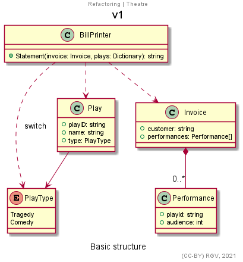
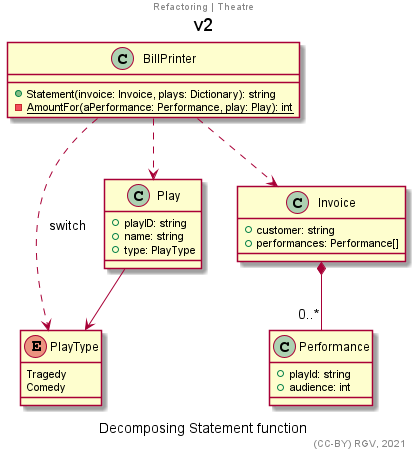
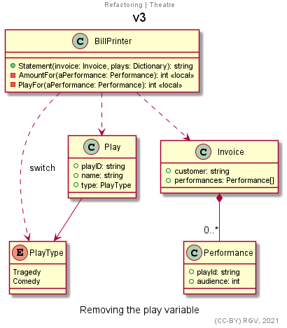
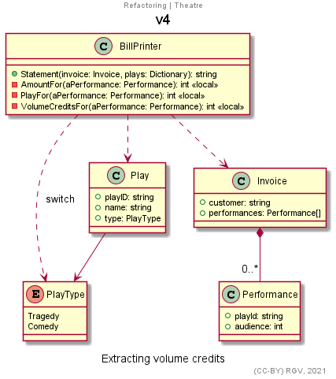
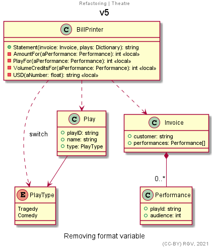
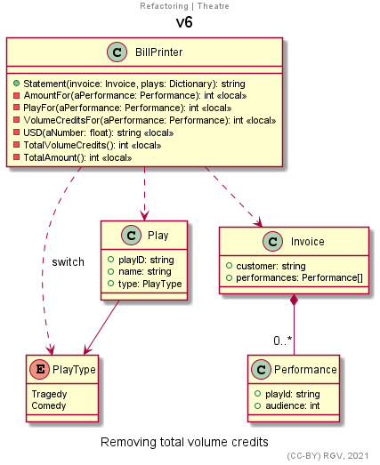
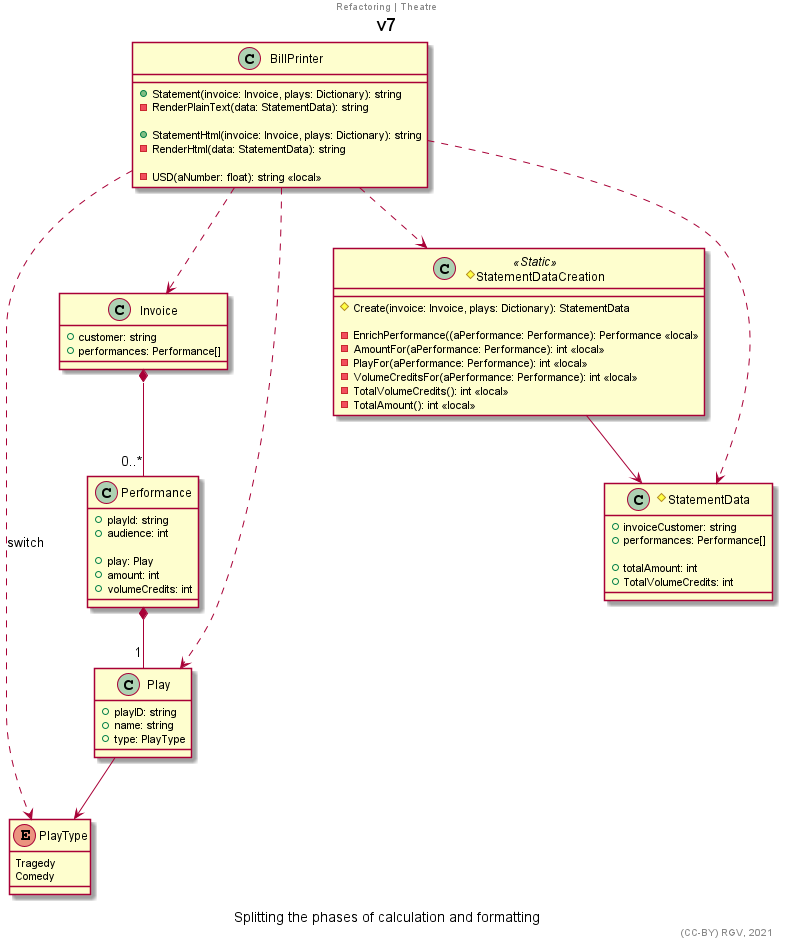
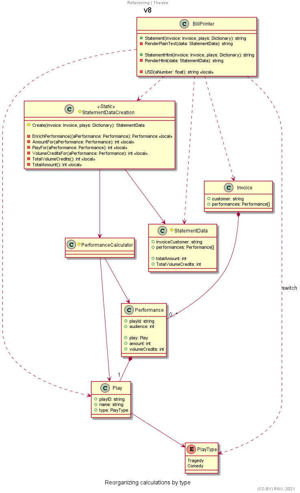
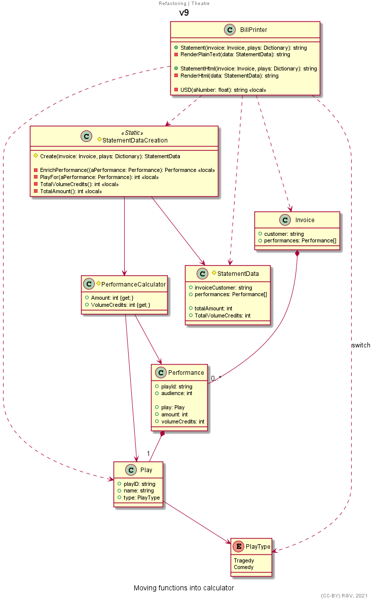
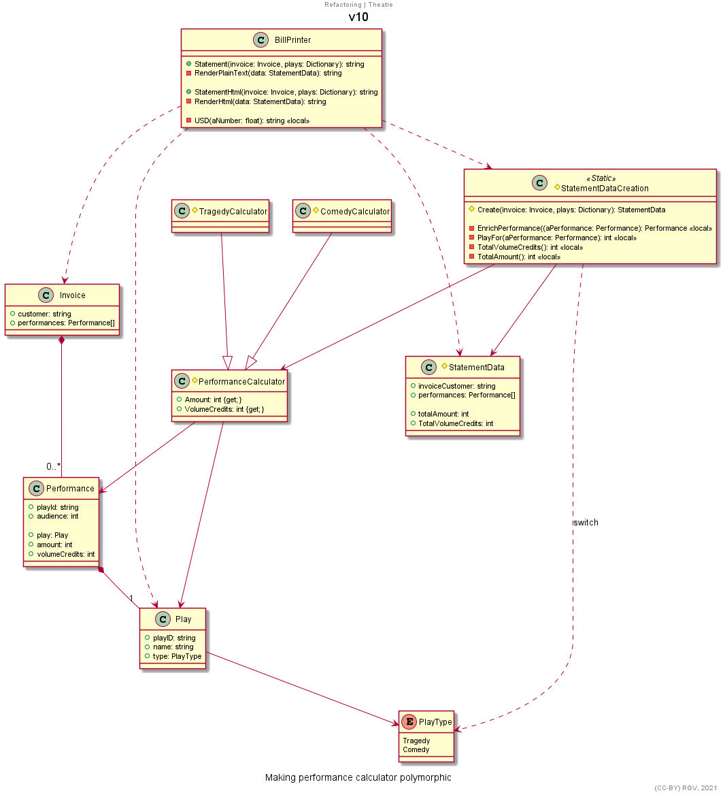
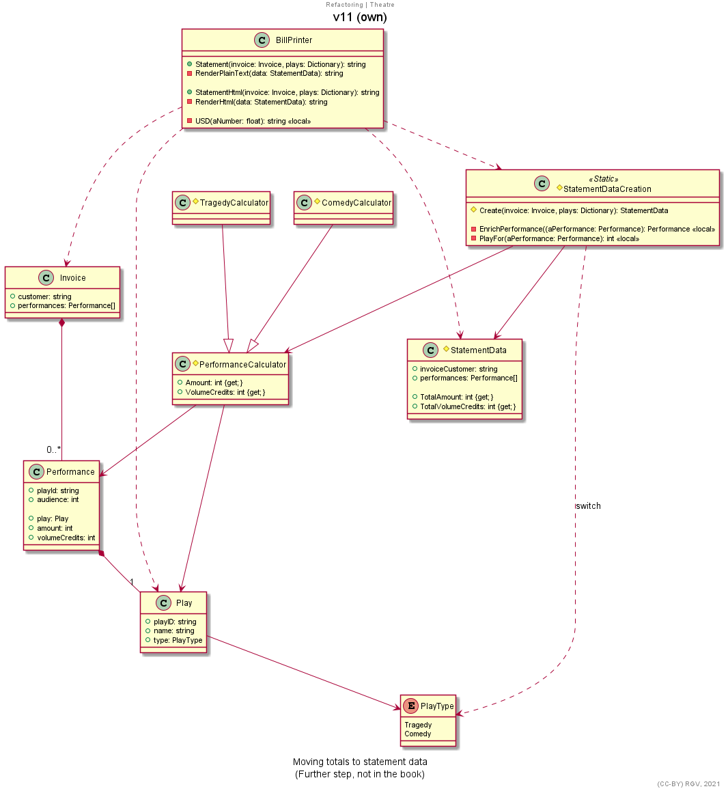

## Smells and refactorings catalog

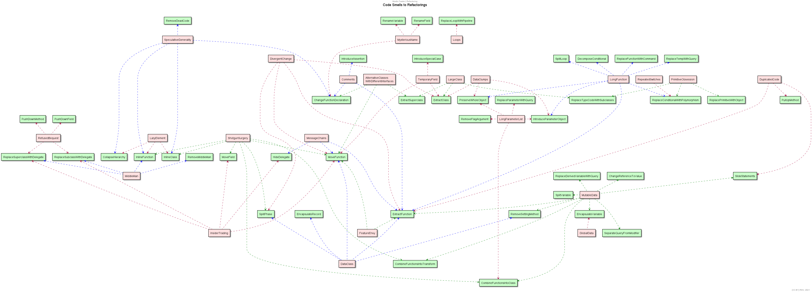
